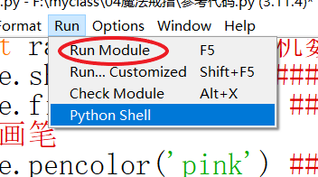

# python笔记

## 01泡泡大作战

### 代码

- 邀请海龟：`import turtle`
- 显示小乌龟形状：`turtle.shape("turtle")`
- 直走：`turtle.forward(100)`
- 走到某个坐标`turtle.goto(1,2)`
- 左转：`turtle.left(90)`
- 右转：`turtle.right(90)`
- 改变画笔
  - 改变画笔颜色：`turtle.pencolor('red')`
  - 改变画笔粗细`turtle.pensize(10)`
  - 画笔悬浮`turtle.pu()`
    - 或者可以写成`turtle.penup()`
  - 画笔放下`turtle.pd()`
    - 或者可以写成`turtle.pendown()`
- 点一个点：`turtle.dot(10)`

### 快捷键

- ctrl+z撤销
- ctrl+x剪切
- ctrl+c复制
- ctrl+v粘贴

### python编辑器

- 新建python程序的方式

  - 点击File，右键new File，运行后保存
  - 新建文本文档，重命名为`文件名.py`
- 运行程序的方式

  - 按快捷键f5快速运行
  - 点击页面Run---->点击Run Module
  - 
- 打开编辑器，显示行数
- 
- 报错了根据报错信息标识的行数去找对应的代码

  - 
  - 应该找到对应的31行进行修改

## 02画气球

### 代码

- 邀请随机数：`import random`
- 生成随机整数：`random.randint(1,100)`
  - `()`内第一个值是最小值，第二个值是最大值，最终生成的随机数会在`[最小值,最大值]`范围内
- 打印：`print('你好python')`
  - `()`内填写要打印的内容
- 声明变量：`a=100`
  - 变量名：a
  - 变量值：100
- 赋值：`a=200`
  - 把原本的100拿掉换成200

## 03画风车

### 代码

- 海龟说话：`turtle.write('我说话了')`
- 海龟说话，修改字体：`turtle.write('我说话了',font=("宋体",100))`
  - `()`内第一个参数是海龟要说的内容，第二个是字体的样式

## 04魔法戒指

### 代码

- 修改画笔颜色

  - `turtle.pencolor(r,g,b)`
  - r,g,b是三个数，范围都是在[0,255]
  - 要设置颜色在[0,255]的范围必须提前设置颜色模式`turtle.colormode(255)`
- 颜色填充

  - 选择一个颜色填充：`turtle.fillcolor('green')`
  - 也可以使用rgb，`turtle.fillcolor(r,g,b)`
  - 开始填充：`turtle.begin_fill()`
  - 结束填充：`turtle.end_fill()`

## 05几何世界

### 内容

- 等边三角形
  - 三条边，三个角(60度)
  - 内角和：180度
- 正方形
  - 四条边，四个角(90度)
  - 内角和：360度
- 正五边形
  - 五条边，五个角(108度)
  - 内角和：540度
- 正六边形
  - 六条边，六个角(120度)
  - 内角和：720度

### 代码

- `turtle.seth(90)`让海龟头转到某个度数

## 06蜗牛壳

### 代码

- `turtle.circle(100)`画圆，`()`内填写所画圆的半径
- for循环

  - 作用：重复执行特定的代码块（循环体），直到满足指定条件为止
  - 格式：

  ```python
  for i in range(4):
    循环体
    print(4)
  ####结果是0,1,2,3
  ####i的初始值是0，每执行一次for循环i都会加1
  ####当i=4退出循环
  ####一共执行了4次
  ####循环体内要缩进四个空格
  ```

## 07天蓝音乐棒

### 内容

- 什么是数列

  - 一串有规律的数
  - 例如：1，4，8，13，19，两两相差3，4，5，6
- 什么是等差数列

  - 一串有规律的数，并且其中每个数字与其前面的数字之差都相等。
  - `a1 a2 a3 a4 a5`
  - 等差数列中重要的数
    - 首项：数列第一个数`a1`
    - 公差：前后两个数之间的差值
    - 尾项：数列最后一个数`a5`
  - 规律：`a2=a1+公差`

### 代码

- 设置背景颜色

  - 方式1：`turtle.bgcolor('black')`
    - `()`内填写各个颜色的英文
  - 方式2：可以使用rgb，我们可以发现用到颜色的地方都可以用rgb代替颜色的英语，大大方便我们使用python

  ```python
  turtle.colormode(255)###设置颜色模式为255
  turtle.bgcolor(100,101,211)###使用(r,g,b)各个数值的范围在[0,255]
  ```

## 08彩色音乐棒

### 内容

- 什么是等比数列
  - 一串有规律的数，其中每个数字与其前面的数字之比都相等。
  - `a1 a2 a3 a4 a5`
  - 等比数列中重要的数
    - 首项：数列第一个数`a1`
    - 公比：前后两个数之间的比值，不能是0
    - 尾项：数列最后一个数`a5`
  - 规律：`a2=a1*公比`

## 09太阳

##　代码
-　多重循环

```python
for i in range(3):
  print(i)
  for j in range(3):
    print(j)

###输出
###进入循环
###当i=0，j=0,打印0，0
###当i=0，j=1,打印0，1
###当i=0，j=2,打印0，2
###退出j循环，i加1

###当i=1，j=0,打印1，0
###当i=1，j=1,打印1，1
###当i=1，j=2,打印1，2
###退出j循环，i加1

###当i=2，j=0,打印2，0
###当i=2，j=1,打印2，1
###当i=2，j=2,打印2，2
###退出j循环，i加1
###退出i循环
```

- 画圆：turtle.circle(圆的半径，圆心角)
- 如果半径为正数，则圆将会以逆时针方向绘制；如果半径为负数，则圆将会以顺时针方向绘制。

## 11 斐波拉契数列

### 内容

- 什么是斐波拉契数列
  - `1 1 2 3 5 8 13 21 34 55 89....`
  - 像这样符合`第 n 项 = 第 n – 2 + 第 n – 1`的数列叫做斐波拉契数列

## 12炫彩龙卷风

### 代码

- 条件判断语句

  - 返回True/False
    - True正确的，表示为真
    - False错误的，表示为假
  - 需要用到算数运算符
    - `>`大于
      - `1>2`是False
    - `<`小于
      - `1<2`是True
    - ==等于
      - `1==1`是True
    - !=不等于
      - `1!=1`是False
- if条件判断语句

```python
if 条件判断语句(True/False):
(四个空格)子语句1
elif 条件判断语句(True/False):
(四个空格)子语句2
else:
(四个空格)子语句3

```

- 注意点

  1. if，elif后跟着判断语句，判断语句为True，执行子语句
  2. 其他判断不成立（不为True）执行else
- 主要用法

  - if-else
    ```python
    i=0
    if i==1:###0不等于1，返回false
      print(i)##不执行
    else: 
      print('i不是1')##执行
    ```
  - if-elif-else
    ```python
    i=0
    if i==1:###0不等于1，返回false
      print('i是1')##不执行
    elif i==2:###0不等于2，返回false
      print('i是2')###不执行
    else: 
      print('i不是1,i不是2')##执行
    ```
- if和elif的区别

  - 当使用条件语句时，if和elif有一些不同之处。
  - if语句的作用是检查一个条件是否为真，如果条件为真，则执行相应的代码块。即使前面的条件满足，它也不会被跳过，而是始终进行判断。因此，可以使用多个if语句来独立判断每个条件。
  - elif语句用于在多个条件之间进行选择。它会依次检查前面的条件是否为真，如果前面的条件满足，则会直接跳过后面的条件判断，执行相应的代码块。这种特性使得代码更加简洁，避免了不必要的条件判断。
- turtle.speed(数值)修改海龟绘图速度，0最快，1最慢，2-10依次增快

## 13音乐棒

###　代码
-　turtle.numinput()用于显示一个提示框，让用户输入一个数值。

- 参数1：提示框的标题，字符串类型。
- 参数2：提示框中的文本信息，字符串类型。

## 14回旋镖

### 代码

- 如果if后面条件判断语句需要多个的话，我们可以使用逻辑运算符把它们连起来
- 逻辑运算符
  - and，与
    - 语法：`条件判断语句1 and 条件判断语句2`
    - 只有当条件判断语句都为True，它才会为True
    - 换言之，有一个条件判断语句为False，它就会为False
  - or，或
    - 语法：`条件判断语句1 or 条件判断语句2`
    - 有一个条件判断语句为True，它就会为True
    - 换言之，所有条件判断语句都为False,它才会为False
  - not，非
    - 语法：`not 条件判断语句`
    - 条件判断语句为False,它才会为True
    - `not True==False`
- 数据类型
  - 数值
    - 整数，像1，2，3，4，5，6
    - 小数，像1.5，0.8
  - 字符串(String)：像"我爱python","python好好玩"
  - 布尔值(Boolearn)：True/False
    - True表示为真
    - False表示为假

## 15奇妙正方形

### 内容

- 函数
  - 什么是函数？

  ```
  在Python中，函数就像一个工具包，可以把一段可复用的代码封装起来。
  它接收输入（称为参数），并按照预定义的步骤执行操作，然后返回一个输出结果。
  可以将函数想象成一个有特定功能的小机器，当你需要完成某个任务时，只需要调用函数，它就会按照你设定的流程自动执行，并给你一个结果返回，就像按下按钮后机器会完成你需要的工作一样。
  这样的函数可以用来执行各种任务，比如计算数字、处理文本、绘制图形等。通过使用函数，我们能够使代码更加清晰、结构化和可维护，同时也能避免重复编写相同的代码。
  ```
### 代码
- 定义函数
```python
##函数体外
def 函数名 (参数列表):
(四个空格)函数体内
```
- 调用函数
`函数名(参数列表)`
  - 函数被调用，函数体被执行一遍
  - 调用函数会有一个返回值

## 16五彩时钟
### 代码 
- datetime模块
  - 邀请时间 `from datetime import datetime`
  - 获得当前时间：`shijian=datetime.now()`
  - 获得当前时间的小时：`hh=shijian.hour`
  - 获得当前时间的分钟：`mm=shijian.minute`
  - 获得当前时间的秒钟：`ss=shijian.second`
- print()函数有可选参数：
`sep：用于分隔多个要打印的对象之间的字符串。默认值为空格。`
- turtle.clear()清除之前画的内容
- turtle.tracer(False)关闭绘图动画
- turtle.tracer(True)开启绘图动画
- turtle.update()手动刷新一次图像
- turtle.ontimer(函数名,时间(单位毫秒))用于在指定的时间间隔之后调用一个函数。

## 17小鸡啄米
- `global x`是一种声明，用于在函数内部使用全局变量x。
  - 局部变量：
    - 局部变量是在函数内部定义的变量，只有在函数内部才能使用。
  - 全局变量：当我们在 Python 中声明一个变量，并将其放在任何函数之外，那么这个变量就是一个全局变量。这意味着这个变量可以在整个程序的任何地方使用，包括函数内部。

## 18小鸡啄米（进阶）
- `turtle.onkeypress(函数名,按键)`可以帮助你在按下特定键时执行一些操作。
- `turtle.onkeyrelease(函数名,按键)`可以帮助你在松开特定键时执行一些操作。
- `turtle.listen()`开始监听用户的输入，不调用这一行上面的代码无效
## 20五等分圆
- 什么是列表
  - 列表存储一组相关的值。
  - 可以将列表想象成一个容器，可以放入多个元素，这些元素可以是任何类型的数据，比如数字、文字、甚至其他列表。
- 声明列表
  - 声明列表和声明变量很像
  ```python
  ###列表名=[元素1,元素2,元素3]
  cars=['red','green','yellow','blue','gray']
  ```
- 使用列表
  - 读取列表中的元素
  ```python
  ###列表名[元素索引]
  cars[0]
  ``` 
  - 注意，跟for循环中的i一样，列表中的索引也是从0开始的，例如这里想拿到黄色，应该是`cars[2]`
  - 修改列表中的元素
    - 读取列表中的元素并对它重新赋值
  ```python
  ###列表名[元素索引]=值
  cars[0]='orange'
  ``` 
- 列表的拓展
  - len(列表名)返回一个列表的长度
  ```python
  chang=len(cars)
  print(chang)###打印5
  ##列表的索引是0，1，2，3，4
  ##发现最后的索引是4，而列表的长度是5，如果要读取列表的末尾应该cars[chang-1]
  ``` 
  - list(reversed(列表名))翻转列表，并且返回一个新列表
  ```python
  nums=[1,2,3,4]
  nums=list(reversed(nums))
  print(nums)
  ###结果是[4,3,2,1]
  ```
## 21神秘笑脸
- `turtle.onscreenclick(函数名,按键)`指定当鼠标在屏幕上点击时要执行的函数。这个函数可以接受一个函数作为参数，当鼠标点击时，该函数将被调用。
- 函数是python帮我们调用，会自动传入两个参数`(x,y)`，表示鼠标在屏幕的位置
```python
cv = turtle.getcanvas()##获得画布
cv.bind("<Motion>", change_eye)###给画布绑定事件，(事件类型,函数名)
```